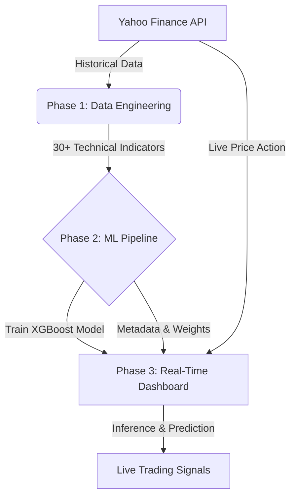

<div align="center">
  

  <h1>📈 Esti: AI Quantitative Trading System</h1>
  <p><strong>Advanced Machine Learning Trading Bot & Real-Time Analytics Dashboard</strong></p>

  [](https://esti-finance-ai.streamlit.app/)
  []()
  []()
</div>

<br>

## 📖 About the Project
**Esti** is a professional, end-to-end quantitative trading system designed to predict the price movements of cryptocurrencies and major tech stocks. It employs **Machine Learning (XGBoost)** to process decades of historical market data and generates real-time actionable signals (BUY/SELL/HOLD).

The project features a sleek, "Glassmorphism" styled Streamlit dashboard, providing investors with deep technical insights, real-time momentum tracking, and Monte Carlo probability forecasts.

---

## ⚡ Key Features

* **🧠 AI Quantum Signal:** XGBoost classifier predicting if an asset will grow >2% in the next 3 days, trained with strict `TimeSeriesSplit` cross-validation.
* **📊 30+ Technical Indicators:** Automated calculation of RSI, MACD, Stochastic Oscillators, Bollinger Bands, Volatility, and Lagged Returns.
* **🎲 Monte Carlo Simulation:** Advanced mathematical modeling generating 100 possible future price paths for the next 7 days based on recent volatility.
* **📈 Real-Time Interactive HUD:** Dynamic Plotly charts with togglable Overlays (Support & Resistance, SMA, Bollinger Bands, Volume).
* **🌐 Production Ready:** Fully portable codebase, GitHub-ready `.gitignore`, and seamless CI/CD integration with Streamlit Community Cloud.

---

## 🏗️ System Architecture



---

## 💻 Tech Stack

| Category | Technology |
| --- | --- |
| **Data Engineering** | `Pandas`, `Numpy`, `yfinance` |
| **Machine Learning** | `Scikit-Learn`, `XGBoost`, `ta` (Technical Analysis) |
| **Frontend / UI** | `Streamlit`, Custom CSS (Glassmorphism) |
| **Data Visualization** | `Plotly Graph Objects` |

---

## 🚀 Installation & Setup

If you want to run this project locally on your machine, follow these steps:

**1. Clone the repository:**
```bash
git clone https://github.com/Amertos/Esti.git
cd Esti
```

**2. Set up virtual environment and install dependencies:**
```bash
python -m venv venv
# On Windows:
venv\Scripts\activate
# On Mac/Linux:
source venv/bin/activate

pip install -r requirements.txt
```

**3. Run the complete pipeline:**
```bash
# Generate the datasets
python phase1_data.py

# Train the AI Models
python phase2_model.py

# Launch the Web Application
streamlit run phase3_dashboard.py
```

---

## 📸 Dashboard Preview

> **Note to developer:** *Add a screenshot of your beautiful Streamlit dashboard here by uploading an image into your GitHub repository and linking it below!*
> 
> ``

---

## ⚠️ Disclaimer
This system is an **educational project** and a demonstration of Data Science, Machine Learning, and Software Engineering skills. It is **not** financial advice. Always do your own research before investing in the stock or crypto market. ML models can make mistakes.
